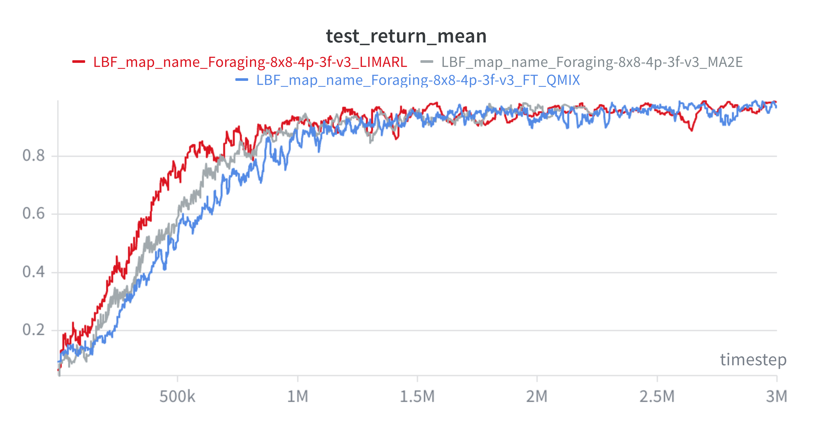

# icml-26

## 📊 Experimental Results

### Mean Return on Foraging (8x8, 4p, 3f)

The figure above shows the training performance in terms of **mean episodic return** over time (timesteps) on the **Foraging-8x8-4p-3f-v3** environment.

We compare three methods:
- **LIMARL (red)** — *our proposed method*
- **MA2E (gray)** — a baseline multi-agent exploration method  
- **FT-QMIX (blue)** — a fine-tuned variant of QMIX  

---

## 🔍 Key Observations

- **Faster learning:** LIMARL achieves higher returns earlier in training.
- **Improved stability:** Smoother learning curve with fewer fluctuations.
- **Sample efficiency:** Reaches strong performance with fewer timesteps.
- **Comparable final performance:** All methods converge similarly, but LIMARL does so faster.

---

## 🧠 Environment Description

### Foraging-8x8-4p-3f-v3

This experiment is conducted in a **cooperative multi-agent gridworld** environment.

#### 📐 Setup
- **Grid size:** 8 × 8  
- **Number of agents:** 4  
- **Number of food items:** 3  
- **Environment type:** Cooperative, partially observable  

#### ⚙️ Dynamics
- Agents can move in four directions or stay in place.
- Food items are randomly distributed across the grid.
- Some food requires **multiple agents to cooperate** for collection.
- Rewards are:
  - **Shared among all agents**
  - Granted when food is successfully collected
- Each agent has **limited local observation**, making coordination necessary.

---

## 🚀 LIMARL (Our Method)

**LIMARL** is our proposed multi-agent reinforcement learning method designed to improve:

- **Coordination efficiency** in cooperative environments  
- **Learning speed** under sparse and delayed rewards  
- **Training stability**

### Key Ideas
- Better **representation learning** across agents  
- Improved **credit assignment**  
- More effective **interaction modeling** between agents  

---

## 📌 Summary

LIMARL consistently outperforms baseline methods in early and mid training stages, demonstrating superior **sample efficiency** and **stability**, while achieving competitive final performance.
